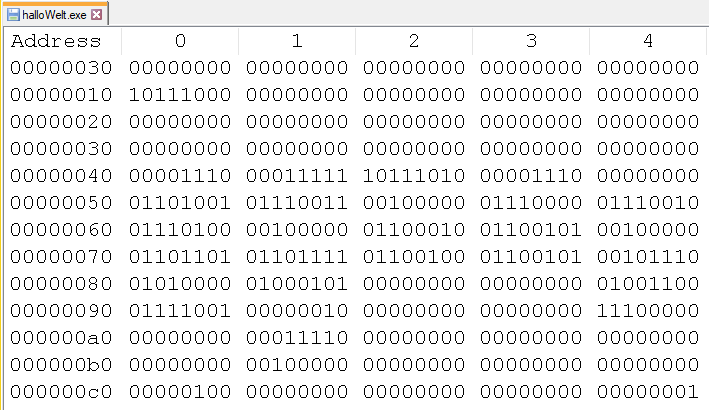
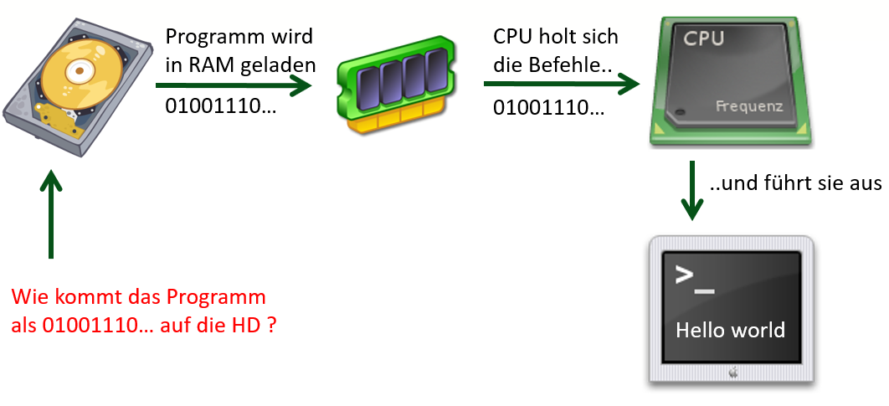
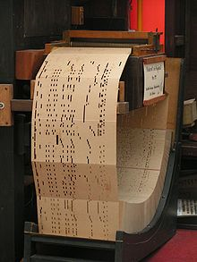
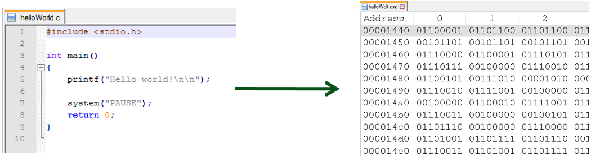
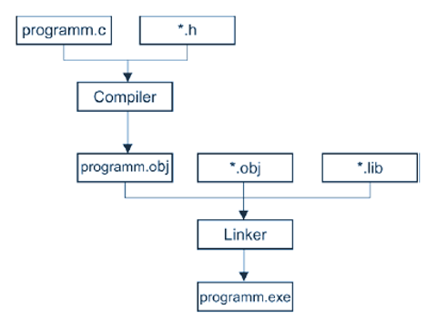
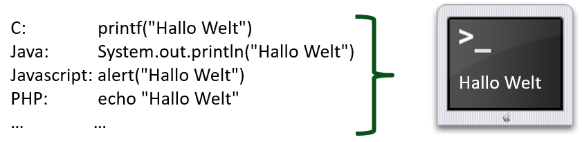
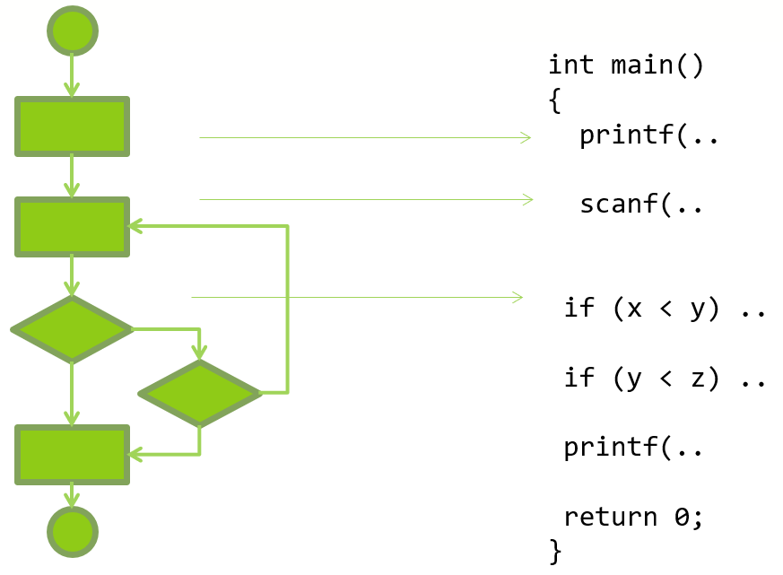
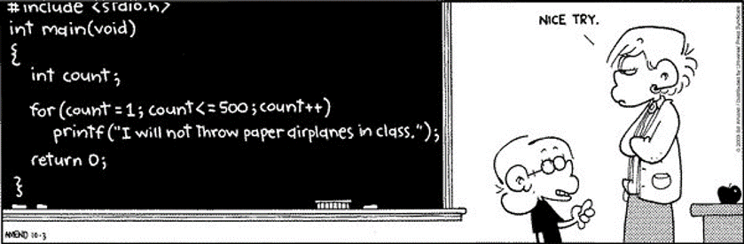

# Was ist ein Programm?

## Wie spreche ich mit dem Computer?

{style="width:600px;"}  
_Abb. 1: Wie spreche ich mit einem Computer?_

{style="width:600px;"}  
_Abb. 2: Computer verstehen nur 0 - 1_

{style="width:600px;"}  
_Abb. 3: Wie funktioniert ein Programm?_

Wie kommt das 01-Programm auf die Harddisk? Man könnte die Datei direkt bearbeiten!
Dies wurde in den Anfangszeiten der Programmierung auch tatsächlich so gemacht:  
{style="width:600px;"}  
_Abb. 4: Programmierung mit 0 und 1 in den Anfangszeiten .._

## Kompilieren

Heutzutag schreibt man ein Programm in einer Programmiersprache. Anschliessend wird es in das 01-Programm übersetzt.
Der Fachbegriff für den Übersetzungsvorgang lautet **kompilieren (engl: to compile)**.
Die Software welche die Übersetzung ausführt heisst **Compiler**.  
{style="width:600px;"}  
_Abb. 5: .. und heute: kompilieren_

## Linken

Ein Programm besteht aus mehreren Bestandteilen. Diese werden einzeln kompiliert.
Die kompilierten Dateien (Dateiendung .obj) zusammen mit Bestandteilen aus Bibliotheken müssen zu einem lauffähigen Ganzen
zusammengefüht werden (Dateiendung .exe).
Der Vorgang des Zusammenfügens wird als **linken (engl: to link)** bezeichnet.
Die Software welche das Zusammenfügen übernimmt heisst **Linker**.  
{style="width:600px;"}  
_Abb. 6: .. und linken_

## Programmiersprachen

Es gibt sehr viele unterschiedliche Programmiersprachen. Aber alle machen letztendlich dasselbe.
Wie bei menschlichen Sprachen kann man die gleiche Sache in unterschiedlichen Sprachen ausdrücken.
{style="width:600px;"}  
_Abb. 7: Programmiersprachen_

### Programmiersprache C

```c
#include <stdio.h>
int main(void)
{
    printf("Hallo Welt!\n");
    return 0;
}
```

Entstanden: 1974  
Kategorie: prozedural  
Einsatzgebiet: systemnahe Programmierung  
Bemerkung: Entstanden bei der Entwicklung des Betriebssystem UNIX.  
C ist nach wie vor sehr verbreitet.

### Programmiersprache C++

```c++
#include <iostream>
int main()
{
	std::cout << "Hallo Welt!" << std::endl;
}
```

Entstanden: 1980-1983  
Kategorie: prozedural und objektorientiert  
Einsatzgebiet: Anwendungs –und Systemsoftware  
Bemerkung: C++ ist C plus der objektorientierte Teil

### Programmiersprache Java

```java
public class Hallo
{
	public static void main(String[] args)
	{
		System.out.println("Hallo Welt!");
	}
}
```

Entstanden: 1990-1997  
Kategorie: objektorientiert  
Einsatzgebiet: Anwendungen im Webbereich, Standard für Android  
Bemerkung: Berücksichtigt Konzepte von C++

### Programmiersprache C\#

```csharp
class MainClass
{
	public static void Main()
	{
		System.Console.WriteLine("Hallo Welt!");
	}
}
```

Entstanden: 2000-2002  
Kategorie: objektorientiert  
Einsatzgebiet: Anwendungen auf MS-Plattformen  
Bemerkung: Läuft auf .NET-Plattformen. Hat Ähnlichkeit zu Java.
Auch C# berücksichtigt Konzepte von C++

### Weitere Programmiersprachen

- [x] PHP (für Webapplikationen)
- [x] JavaScript (für Programmierung im Browser)
- [x] Python (für Linux Scripte)
- [x] Perl (für Linux Scripte)
- [x] Objective-C / Swift (für iOS Geräte)

## Was heisst programmieren?

Programmieren umfass zwei grundsätzliche Schritte:

> 1. **Verfahren** entwickeln: Wie muss das Programm aufgebaut sein, damit es das macht was es soll. Das Verfahren wird häufig in einem Flussdiagramm oder Struktogramm abgebildet. Das Verfahren wird als **Algorithmus** bezeichnet.
> 1. **Implementieren**: Der Algorithmus wird in einer Programmiersprache abgebildet.

{style="width:600px;"}  
_Abb. 8: Algorithmus entwickeln und implementieren_

Ein Algorithmus ist das rezeptartige Abarbeiten von Anweisungen. Der Algorithmus lässt sich mit einem Kochrezept vergleichen.
Ein Programm nimmt einem ständig zu wiederholende Aufgaben ab.
{style="width:600px;"}  
_Abb. 9: Algorithmus_
