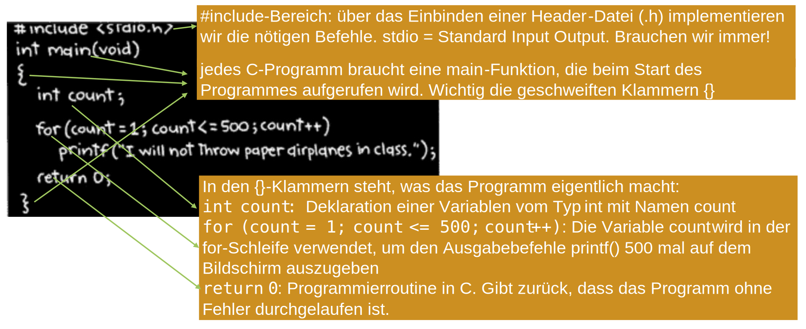
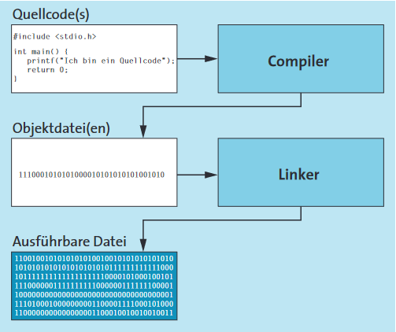
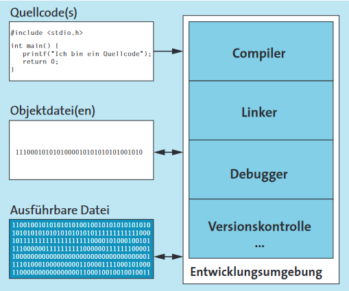
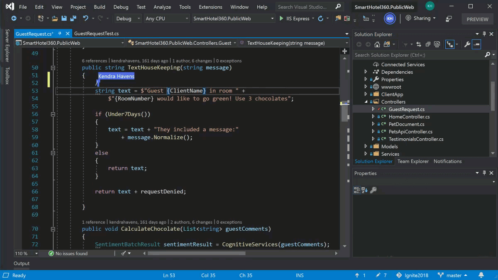
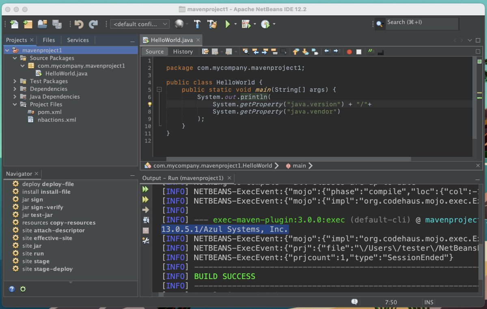
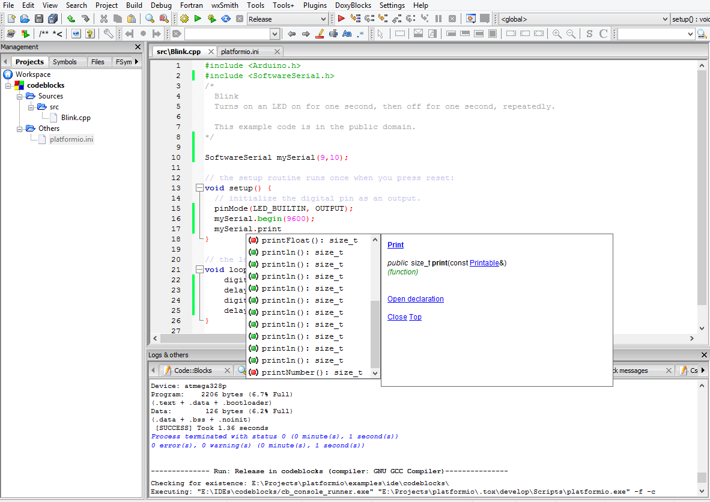

# Werkzeuge für C

## Unser erstes C-Programm

{style="width:600px;"}  
_Abb. 1: Erstes C Programm_

## Wie kommen wir zum C-Programm?

- [x] Problem: Keine Lust, 500 mal das Gleiche zu tippen
- [x] Lösung: Wir verwenden eine Iteration, eine Schleife, einen Loop. Das ist sozusagen ein Algorithmus.
- [x] Darstellung der Lösung als PAP: von Hand oder besser mit Hilfe eines Tools, z.B. Code:Blocks

## Texteditor, Kommandozeile

Um aus einem einfachen C-Quellcode eine ausführbare Datei zu erstellen, gibt es im Grunde zwei Wege – einen ungemütlichen und einen gemütlichen.
Der unbequeme Weg (wobei dies auch Ansichtssache ist) lautet:

> 1.  Den Quellcode in einen beliebigen ASCII-Texteditor eintippen und abspeichern.
> 2.  Den Quellcode mit einem Compiler übersetzen, wodurch eine Objekt-datei (_.obj oder _.o) erzeugt wird.
> 3.  Die Objektdatei mit einem Linker binden, was eine ausführbare Datei erzeugt.

Der Linker sucht dabei alle benötigten Funktionen aus den Standardbibliotheken heraus und fügt sie anschließend dem fertigen Programm hinzu.
Für diesen manuellen Weg bräuchten Sie also nur einen einfachen ASCII-Texteditor, einen Compiler und einen Linker.
Den Compiler und den Linker müssten Sie in der Kommandozeile aufrufen.
In der Praxis wird allerdings eher selten zwischen Compiler und Linker unterschieden, und wenn die Rede von einem Compiler ist,
ist damit meistens gleichzeitigauch der Linker als komplette Einheit gemeint. Abbildung 1 veranschaulicht diese Vorgehen.

{style="width:600px;"}  
_Abb. 6: Compiler und Linker_

## IDE

Der bequemere Weg führt über eine All-in-one-Lösung, eine integrierte Entwicklungsumgebung. (engl. **IDE** **I**ntegrated **D**evelopment **E**nvironment)
Wie der Name schon vermuten lässt, finden Sie hier alles, was Sie zum Programmieren benötigen, in einem Fenster.

{style="width:600px;"}  
_Abb. 7: Integrierte Entwicklungsumgebung_

### Visual Studio von Microsoft

{style="width:600px;"}  
_Abb. 8: Visual Studio_

### Apache NetBeans

{style="width:600px;"}  
_Abb. 9: NetBeans_

### Code::Blocks

{style="width:600px;"}  
_Abb. 10: Code::Blocks_
