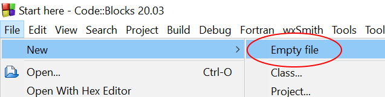
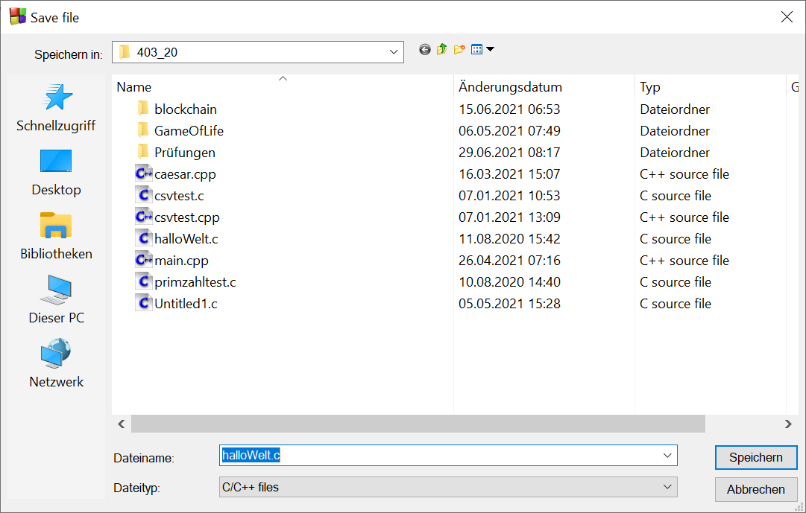
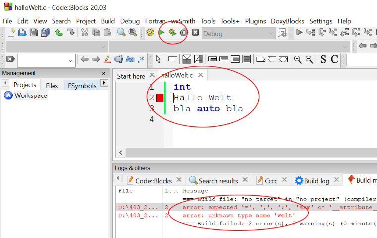

# Code::Blocks

## Installation

Code::Blocks ist eine freie, quelloffene Entwicklungsumgebung insbesondere für C, C++, D und Fortran.
Das Programm basiert auf wxWidgets und läuft unter GNU/Linux, Windows und den meisten Unix-Derivaten.
Es werden mehrere Compiler unterstützt, standardmässig wird jedoch der GCC (unter Windows die Portierung **MinGW**) verwendet.

> 1. Laden Sie die aktuelle Version 20.03 inklusive MinGW hier herunter: [Download](https://www.fosshub.com/Code-Blocks.html?dwl=codeblocks-20.03mingw-setup.exe)
> 2. Installieren Sie Code::Blocks
> 3. Starten Sie Code::Blocks

## Getting started

### Programmablaufplan mit einem Nassi Shneiderman Diagram

> 1. Klicken Sie auf File-> New -> Nassi Shneiderman Diagram
> 2. Testen Sie die unterschiedlichen Elemente und speichern Sie die Datei mit der Endung .nsd ab.

### Erstellung einer C-Datei

> 1. Erstellen Sie eine neue Datei
> 2. Speichern Sie die Datei mit der Endung .c ab.

{style="width:600px;"}  
_Abb. 1: Neue Datei erstellen_

{style="width:600px;"}  
_Abb. 2: Endung .c_

Tippen Sie im Editor den abgebildeten Code ab. Beachten Sie, dass Schlüsselworte automatisch blau markiert werden. Versuchen Sie das Programm zu kompilieren und zu linken mit Klick auf das grüne Zahnrad Symbol.
Natürlich wird die Kompilierung nicht erfolgreich sein. In Zeile 2 wird ein Fehler angezeigt und in der Fehlerkonsole sehen Sie eine Beschreibung zum Fehler. Das *Programm* entspricht eben nicht der C-Syntax (=Grammatik)

{style="width:600px;"}  
_Abb. 3: Erster Versuch_
