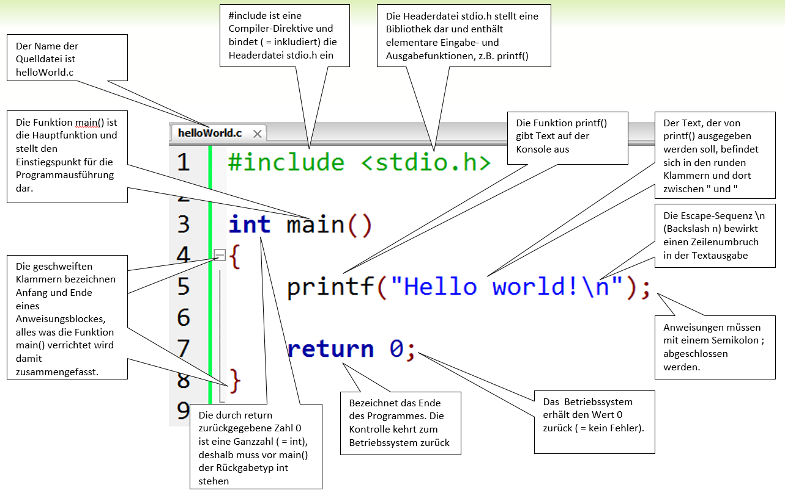

# Das Hallo Welt Programm

## Code
In jeder Programmiersprache gibt es ein sogenanntes Hallo-Welt-Programm, welches das kleinstmögliche Programm darstellt, das einen Output erzeugt.
Beim Erlernen einer Progrrammiersprache ist es deshalb sinnvoll, das Hallo-Welt-Programm als Ausgangspunkt zu nehmen. 
In der folgenden Abbildung sehen Sie das Hallo-Welt-Programm der C-Sprache zusammen mit den Erläuterungen zu den einzelnen Bestandteilen.

{style="width:100%;"}  
*Abb. 1: Das Hallo Welt Programm*

## Erläuterungen
```#include``` ist eine Compiler-Direktive und bindet ( = inkludiert) die Headerdatei stdio.h ein.  
```stdio.h``` Die Headerdatei stdio.h stellt eine Bibliothek dar und enthält elementare Eingabe- und Ausgabefunktionen, z.B. printf().  
```main()``` Die Funktion main() ist die Hauptfunktion und stellt den Einstiegspunkt für die Programmausführung dar.  
```int``` Die durch return zurückgegebene Zahl 0 ist eine Ganzzahl ( = int), deshalb muss vor main() der Rückgabetyp int stehen.  
```{  }``` Die geschweiften Klammern bezeichnen Anfang und Ende eines Anweisungsblockes, alles was die Funktion main() verrichtet, wird damit zusammengefasst.  
```return``` Bezeichnet das Ende des Programmes. Die Kontrolle kehrt zum Betriebssystem zurück.  
```0```Das Betriebssystem erhält den Wert 0 zurück ( = kein Fehler).  
```printf()``` Die Funktion printf() gibt Text auf der Konsole aus.  
```"Hello World"``` Der Text, der von  printf() ausgegeben werden soll, befindet sich in den runden Klammern und dort zwischen " und "
```\n``` Die Escape-Sequenz \n (Backslash n) bewirkt einen Zeilenumbruch in der Textausgabe.  
```;``` Anweisungen müssen mit einem Semikolon ; abgeschlossen werden.


