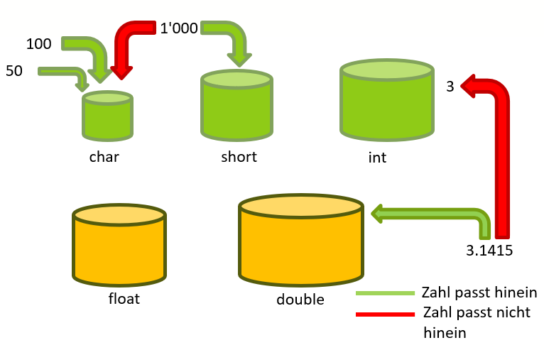

# Variablen

## Was sind Variablen?
Ebenso wie Kochen nicht ohne Kochtopf geht, funktioniert eine Programmiersprache
nicht ohne grundlegende Datentypen, mit denen man Daten
in einer Variablen zwischenspeichern kann. Während Sie allerdings in
einen Kochtopf alles Mögliche hineinschneiden können, müssen Sie bei
den Basisdatentypen genau auf die »Zutaten« achten. In C sind hierfür
Datentypen für Ganzzahlen, Fließkommazahlen und Zeichen vorhanden.

{style="width:100%;"}  
*Abb. 1: Datentypen als Behälter*

Die Datentypen ```short``` und ```int``` können nur Ganzzahlen (Zahlen ohne Kommastellen) speichern. Allfällige Kommastellen werden einfach abgeschnitten.
Der Datentyp ```char``` kann Ganzzahlen und Zeichen (Buchstaben) speichern.
Die Datentypen ```float``` und ```double``` können sogenannte Fliesskommazahlen (Zahlen mit einer gewissen Anzahl Ziffern, inlusive Kommaziffern) speichern.

Die Datentypen unterscheiden sich ausserdem in der maximalen Grösse und Genauigkeit mit der Zahlen gespeichert werden können.  

Eine Variable ist im Grunde genommen nichts anderes als eine Adresse im
Hauptspeicher. Dort legen Sie die Daten ab und greifen später, wenn Sie
den Inhalt wieder benötigen, darauf zurück.

## Deklaration
Bevor Sie eine Variable verwenden können, müssen Sie dem Compiler den
Datentyp und den Namen mitteilen. Dieser Vorgang wird als Deklaration
bezeichnet. (Der Kochtopf wird quasi aus dem Schrank geholt und für die Verwendung bereitgestellt.)

Eine Deklaration erfolgt immer nach folgendem Schema:
```
<Datentyp> <Variablenname>;
```
Die Datentypen legen die Eigenschaften (Grösse und Genauigkeit) der Variablen fest, der Variablenname kann unter Einhaltung bestimmter Regeln beliebig gewählt werde.

Beispiel dazu:
```c
int eineZahl;
int nochEine;
float abc;
```
!!! bug "Deklaration"
    Eine Variable kann in einem Programm nur einmal deklariert werden. Eine Neudeklaration (Redeklaration) führt zu einem Kompilierfehler.

## Wertzuweisung
Nach der Deklaration hat eine Variable noch keinen Wert (keine Grösse). Der Kochtopf ist quasi noch leer. 
Um der Variable einen Wert zu geben, ist eine sogenannte Wertzuweisung nötig. Dieser erfolgt nach folgendem Schema:
```
<Variablenname> = <Wert>;
```
Das Gleichheitszeichen wird als **Zuweisungsoperator** (und nicht als Gleichheit) bezeichnet.

Beispiel zu den Deklarationen von oben:
```c
eineZahl = 5;
nochEine = 27;
abc = 2.56;
```
!!! info "Wertzuweisung"
    Im Gegensatz zur Deklaration kann eine Variable beliebig oft einen neuen Wert erhalten.

## Deklaration mit gleichzeitiger Wertzuweisung
Eine Deklaration und Wertzuweisung kann in einem Schritt erfolgen. Die Variable erhält damit bereit bei der Deklaration einen Wert.
Folgendes Schema gilt:
```
<Datentyp> <Variablenname> = <Wert>;
```
Einige Beispiele dazu:
```c
int zahl2 = 1234567890;
short kleineZahl = 10;
double pi = 3.1416;
```
