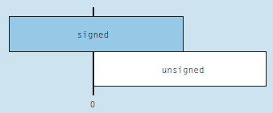

# Ganzzahlen

## Mit Vorzeichen
Für die Speicherung von Ganzzahlen bietet C folgende Datentypen an (nebst anderen):  

| Datentyp  | Wertebereich     | Speicherbedarf |
|-----------|-------------------|---------------:|
| char      | -128 bis +127    | 1 Byte         |
| short     | -32'768 bis +32'767    | 2 Byte         |
| int       | -2'147'483'648 bis +2'147'483'647    | 4 Byte         |

Der Wertebereich, dh. die maximal grösste und minimal kleinste mögliche Zahl des jeweiligen Datentypes ergibt sich aus dem Speicherbedarf.
Dazu ein Beipiel mit einer 3-Bit Zahl. Für 3 Bits gibt es genau 8 Möglichkeiten:
```
000  = 0
001  = +1
010  = +2
100  = +3
011  = -4
101  = -3
110  = -2
111  = -1
```
Mit 3 Bits Speicher kann man also maximal 8 Zahlen abspeichern. Nun lässt sich 8 berechnen als $2^{Anzahl Bits} = 2^{3} = 8$. 
Die 8 möglichen Zahlen werden nun je zur Hälfte auf die positiven und negativen natürlichen Zahlen verteilt.
Der Wertebereich dieser 3-Bit Zahl geht somit von -4 bis +3.

Da nun 1 Byte 8 Bits entspricht, können beim Datentyp ```char``` $2^{8} = 256$ Zahlen gespeichert werden. Wiederum werden dies hälftig auf den
negativen und den poistiven Bereich verteilt, womit sich der angegebene Wertebereich ergibt.

Beim Datentyp ```int``` lautet die Berechnung $2^{32} = 4'294'967'296$, womit sich grob gesagt der Wertebereich von -2 Mia. bis +2 Mia. ergibt

!!! info "Tatsächlicher Speicherbedarf"
    Der tatsächliche Speicherbedarf für diese Datentypen hängt von der Prozessorarchitektur und dem Datenmodell ab. 
	Der tatsächliche Speicherbedarf kann mit der Funktion sizeof(<Datentyp>), z.B. ```sizeof(int)``` ermittelt werden.
	Die hier angegebenen Werte beziehen sich auf eine übliche 32-Bit oder 64-Bit Architektur. 
 
## Ohne Vorzeichen
Wird den Datentypen das Schlüsselwort ```unsigned``` vorangestellt, verschiebt sich der Wertebereich in die positven Zahlen. Der Speicherbedarf ist jedoch derselbe wie bei Ganzzahlen mit Vorzeichen.  

| Datentyp  | Wertebereich     | Speicherbedarf |
|-----------|-------------------|---------------:|
| unsigned char      | 0 bis 255    | 1 Byte         |
| unsigned short     | 0 bis 65'535    | 2 Byte         |
| unsigned int       | 0 bis 4'294'967'295    | 4 Byte         |

  
*Abb. 1: Der Wertebereich verschiebt sich*