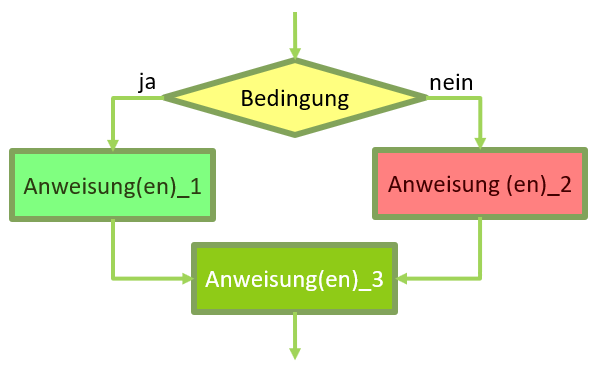
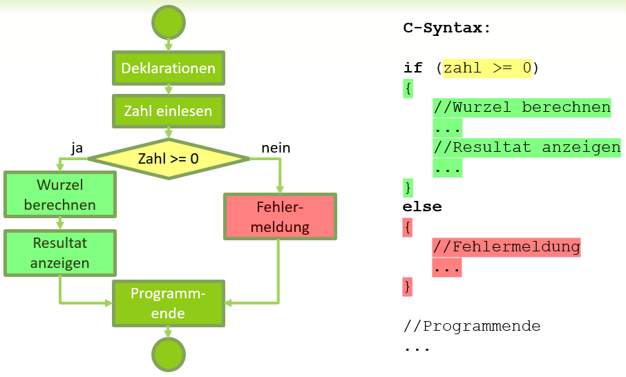

# Verzweigungen
Mit einer Verzweigung können Sie festlegen, dass ein Programm auf unterschiedliche Zustände im Programmablauf reagiert. 

## if .. else ..
Bei einer Verzweigung des Programmablaufes werden bestimmte Codebestandteile (<span class="bg-green">Anweisung(en)_1</span>) nur ausgeführt, 
wenn eine bestimmte <span class="bg-yellow">Bedingung</span> erfüllt ist.
Ist die Bedingung nicht erfüllt, können alternativ andere Codebestandteile (<span class="bg-red">Anweisung(en)_2</span>) ausgeführt werden. 
In beiden Fällen fährt das Programm mit - von der Bedingung unabhängigen - weiteren Anweisungen (Anweisung(en)_3) fort.

  
*Abb. 2: Eine Verzeweigung als Flussdiagramm*

Eine Verzweigung wird als ```if.. else..```-Statement implementiert:
```c
if(Bedingung) 
{
	Anweisung(en)_1;
}
else
{
	Anweisung(en)_2;
}
Anweisung(en)_3;
```

Hierbei wird wie im Flussdiagramm zuerst die <span class="bg-yellow">Bedingung (z.B. zahl > 0)</span> ausgewertet. Je nachdem,
ob die Bedingung wahr ist, werden die <span class="bg-green">Anweisung(en)_1</span> im
Anweisungsblock ausgeführt. Anschließend wird die Programmausführung
mit den Anweisung(en)_3 fortgesetzt. Ist die Bedingung
allerdings unwahr , werden die <span class="bg-red">Anweisung(en)_2</span> im alternativen
else-Anweisungsblock ausgeführt. Anschließend fährt das Programm
mit den den Anweisung(en)_3 fort.

## Beispiel Wurzelziehen
Die ```if .. else ..``` Verzweigung soll an der Thematik Wurzelziehen veranschaulicht werden. 
Bekanntermassen lässt sich die Wurzel aus negativen Zahlen nicht ziehen. Es gibt keine Zahl die mit sich selbst multipliziert z.B. -25 ergibt.
Als Benutzer eines Programmes hätte man daher gerne eine Fehlermeldung über die ungültige Eingabe. Das Prorgamm lässt sich somit
als Flussdiagramm und als Code wie abgebildet realisieren:  
  
*Abb. 2: Flussdiagramm und Code eines Programmes, das auch mit negativen Zahlen korrekt umgeht*

## if .. ohne else
Nicht immer ist es nötig einen else-Teil bei einer Verzweigung zu haben. Im folgenden Beispiel wird der Zusatz positive Zahl ausgegeben, 
wenn immer die Zahl grösse 0 ist. In beiden Fällen wird die Zahl ausgegeben.
```c
if(zahl > 0) 
{
	printf("Sei haben eine positive Zahl eingegeben. ");
}
printf("Die Zahl lautet %d", zahl);
```
```
Sei haben eine positive Zahl eingegeben. Die Zahl lautet 25.
```
oder
```
Die Zahl lautet -25.
```
!!! bug "else ohne if"
    Ein else ohne ein dazugehöriges if kann es nicht geben. Ein häufiger Fehler ist es nun, nach der Bedingung ein Semikolon zu
	setzen. Damit ist die Verzweigung bereits beendet und das nachfolgende else gehört zu keinem if. Ein Kompilierfehler ist die Folge.
    ```c
	if (alter >= 18);  //FALSCH Semikolon
	{
		printf("Sie sind volljährig");
	}
	else               //hier gibt es einen Kompilierfehler
	{
		printf("Sie sind nicht volljährig"); 
	}
	```

## Vergleichsoperatoren
Im Bedingungsausdruck können die folgenden Vergleichsoperatoren verwendet werden:
```c
if (alter > 18)  //grösser 			Trifft zu wenn Alter 19, 20, 21,...
if (alter >= 18) //grösser gleich 	Trifft zu wenn Alter 18, 19, 20, ...
if (alter < 18)  //kleiner 			Trifft zu wenn Alter 17, 16, 15,...
if (alter <= 18) //kleiner gleich 	Trifft zu wenn Alter 18, 17, 16,...
if (alter == 18) //gleich 			Trifft zu wenn Alter genau 18 ist
if (alter != 18) //ungleich 		Trifft zu wenn Alter nicht 18 ist
```

!!! bug "Das Doppelgleich"
    Ein häufiger Fehler ist es, anstelle des Doppelgleichs ein einfaches Gleich zu verwenden. 
	Dieses hat aber schon die Funktion des Zuweisungsoperators und kann nicht für Vergleiche verwendet werden. 
	Es gibt jedoch keinen Kompilierfehler, sondern es wird dann einfach eine Wertzuweisung ausgeführt,
	was zu unerwarteten Resultaten führt.
    ```c
	if (alter = 18)  //FALSCH. Wertzuweisung
	```
