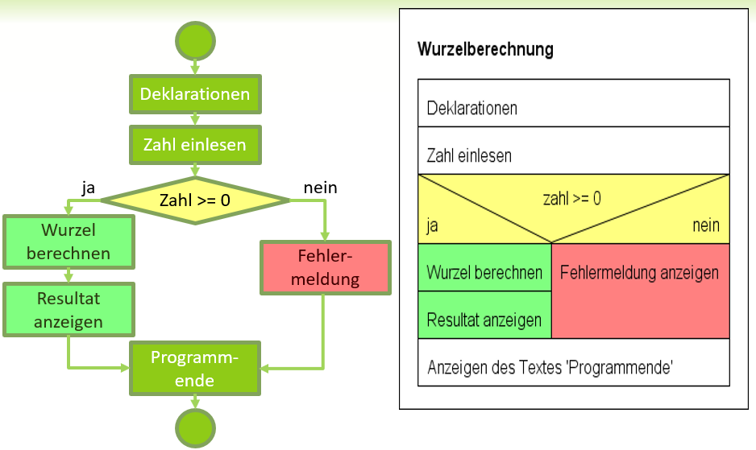

# Struktogramme

- [x] Struktogramme sind ein Hilfsmittel um den Programmaufbau besser zu verstehen und visuell darzustellen
- [x] Sequenzen (Anweisungen) werden als Rechtecke dargestellt
- [x] if .. else .. Wird mit dem abgebildeten Symbol dargestellt
- [x] Die Bedingung wird im oberen Teil notiert.
- [x] Trifft diese zu wird der True (ja) Ast ausgeführt, ansonsten (else) der False (nein) Ast.
- [x] Die weiteren Anweisungen werden anschliessend ausgeführt
- [x] Struktogramme eignen sich besser zur Programmablaufdarstellung als Flussdiagramme

  
*Abb. 1: Flussdiagramm und Struktogramm*
