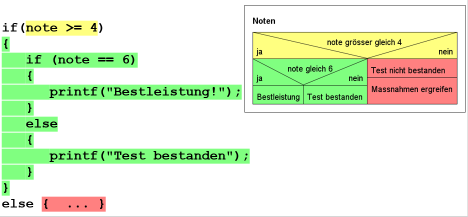

# Verschachtelungen

```if .. else ..``` Anweisungen lassen sich beliebig verschachteln
d.h. jedes ```if``` und/oder jedes ```else``` können weitere ```if .. else ..``` Anweisungen enthalten.

Dies soll am Beispiel einer Notengebung veranschaulicht werden:  
  
*Abb. 1: Verschachtelungen von if.. else..*

Falls die Note ungenügend ist wird der rote Programmteil ausgeführt. 
Für den Fall einer genügenden Note findet eine weitere Fallunterscheidung nach Bestleistung und Test bestanden statt.

!!! tip "Tip: Verschachtelungen"
    Bei verschachtelten if.. else.. Anweisungen geht schnell die Übersicht verloren ( welches else gehört zu welchem if), deshalb:  
	1. Erstellen Sie zuerst ein leeres Grundgerüst für die if .. else .. Anweisung (ohne Code darin)
    ```c
	if(note >= 4)
	{
	}
	else 
	{
	}
	```
	2. Ergänzen Sie den Code innerhalb der if- und else Teile erst anschliessend. Falls es sich wieder um ein if .. else .. Anweisung handelt, erstellen Sie ebenfalls zuerst das leere Grundgerüst
    ```c
	if(note >= 4)
	{
		if (note == 6)
		{
		}
		else
		{
		}
	}
	else 
	{
	}
	```