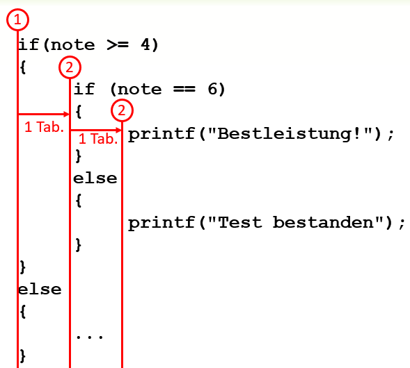

# Formatierregeln für Code
Bei Verschachtelungen geht schnell die Übersicht verloren (welches else gehört zu welchem if). Die Darstellung des Codes, beziehungsweise
die Einrückungen müssen deshalb gewisse Regeln einhalten:

> 1. Die öffnende und schliessende Blockklammern stehen links an der Vorgängerzeile ausgerichtet
> 2. Der Code innerhalb der öffnenden und schliessenden Blockklammern steht um 1 Tabulator nach rechts eingerückt

Dies lässt sich mit senkrechten Linien visualisieren:  
  
*Abb. 1: Code-Einrückungen*

In den meisten Codeeditoren lassen sich diese senkrechten Linien als Unterstützung zuschalten. Sie werden als **indentation guides** bezeicheichnet.
 In Code::Blocks ist diese Option unter *Settings/Editor/Show indentation guides* zu finden.
 
  
*Abb. 2: indentation guides*