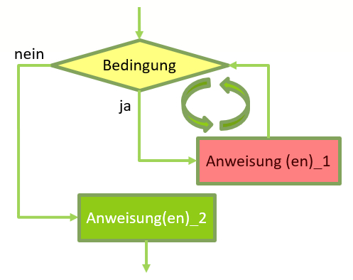
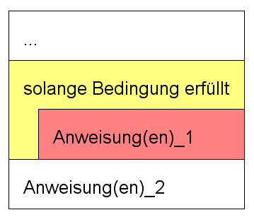
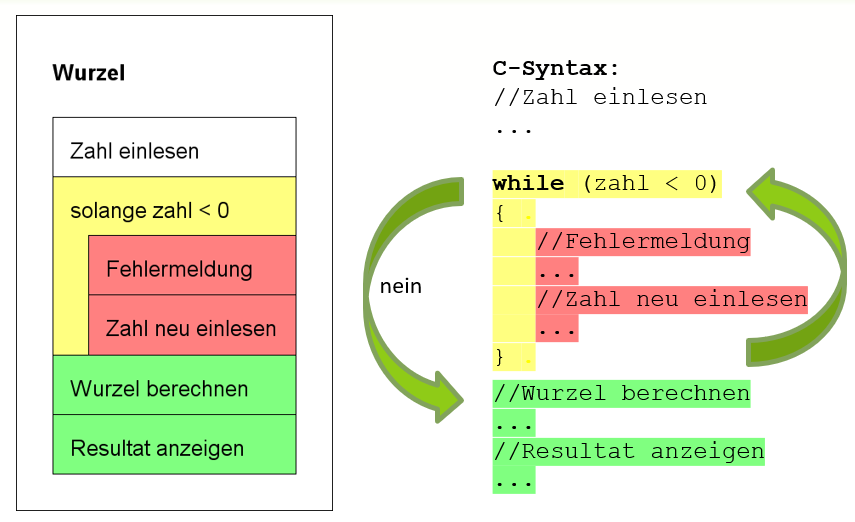

# while Schleife
Wenn Sie eine Gruppe von Anweisungen mehrfach ausführen wollen,
stellt Ihnen C mit while, do while for drei verschiedene Schleifen –
sogenannte Iterationsanweisungen oder auch Wiederholungen – zur Verfügung.

## Syntax
Bei einer while-Schleife werden bestimmte Codebestandteile (<span class="bg-red">Anweisung(en)_1</span>) solange wiederholt als eine bestimmte <span class="bg-yellow">Bedingung</span> erfüllt ist.
Nach jedem Schleifendurchgang wird die Bedingung erneut überprüft. Solange die Bedingung erfüllt ist werden die <span class="bg-red">Anweisung(en)_1</span> wiederholt. Ist die <span class="bg-yellow">Bedingung</span> nicht mehr erfüllt fährt das Programm mit den Anweisungen nach der Schleife fort.  
  
*Abb. 1: Flussdiagramm einer while Schleife*

Die while-Schleife ist eine kopfgesteuerte Schleife und führt einen Block
von Anweisungen **so lange** aus, wie die Schleifenbedingung wahr ist. Die
Syntax der while-Schleife sieht folgendermaßen aus:
```c
while(Bedingung) 
{
	Anweisung(en)_1;
}
Anweisung(en)_2;
```

## Struktogramm
Das Symbol der while-Schleife in einem Struktogramm sieht wie abgebildet aus:  
  
*Abb. 2: Struktogramm und while-Schleife*

## Beispiel Wurzelziehen
In unserer letzten Verison des [Wurzelprogrammes](../5-10/#beispiel-wurzelziehen) wurde zwar eine Fehlermeldung erzeugt, wenn der Benutzer
eine negative Zahl eingegeben hat, anschliessend beendet sich das Programm. Besser wäre es jedoch, wwenn man die Möglichkeit erhielte dieZahl erneut einzugeben, 
vielleicht war es ja nur ein Vertipper. Die lässt sich nun mit einer while-Schelife realisieren. Die while Schleife wird solange wiederholt,
als der Benutzer eine negative Zahl eingibt:

  
*Abb. 3: Wurzelprogramm und while-Schleife*

## Beispiel Viererreihe
```c
//Deklarationen
int i;
int zahl = 4;

i = 1;
while(i <= 10)
{	
   produkt = i * zahl;
   printf("%d x %d = %d\n",i , zahl, produkt);
   
   i = i + 1;
}
```
zeigt an
```
1 x 4 = 4
2 x 4 = 8
3 x 4 = 12
...
10 x 4 = 40
```