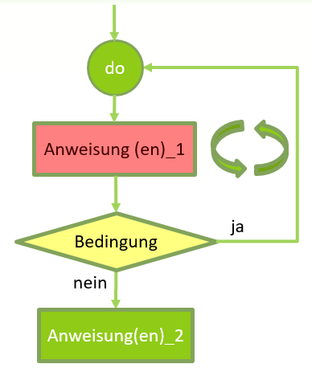

# do .. while Schleife

## Syntax
Bei einer do..while-Schleife werden bestimmte Codebestandteile (<span class="bg-red">Anweisung(en)_1</span>) solange wiederholt als eine bestimmte <span class="bg-yellow">Bedingung</span> erfüllt ist.
Nach jedem Schleifendurchgang wird die Bedingung erneut überprüft. Solange die Bedingung erfüllt ist werden die <span class="bg-red">Anweisung(en)_1</span> wiederholt. Ist die <span class="bg-yellow">Bedingung</span> nicht mehr erfüllt,
fährt das Programm mit den Anweisungen nach der Schleife fort.  
Im Gegensatz zur while-Schleife (**kopfgesteuert**) wird die Bedingung erst am Ende der Schleife überprüft. Man spricht deshalb von einer **fussgesteuerten** Schleife Damit ist garantiert, dass die <span class="bg-red">Anweisung(en)_1</span> der Schleife mindestens einmal ausgeführt werden.

  
*Abb. 1: Flussdiagramm einer do..while Schleife*

Die
Syntax der do..while-Schleife sieht folgendermaßen aus:
```c
do 
{
	Anweisung(en)_1;
} 
while(Bedingung);

Anweisung(en)_2;
```

## Struktogramm
Das Symbol der do..while-Schleife in einem Struktogramm sieht wie abgebildet aus:  
  
*Abb. 2: Struktogramm und do..while-Schleife*

	
## while vs. do..while
Im folgenden Beispiel werden auf zwei auf den ersten Blick identische Wiederholungen einmal als while und das andere Mal als do..while Schleife implementiert:
```c hl_lines="3"
int i, zahl = 5;			int i, zahl = 5;

i = 1;						i = 1;
while(i <= 10)				do
{							{
   printf("%d ", i);			printf("%d ", i); 
   i = i + 1;					i = i + 1;
}							}while(i <= 10);
```
Tatsächlich werden in beiden Fällen dieselben Zahlen (1 2 3 .. 10) auf der Konsole ausgegeben. Wo liegt also der Unterschied?

Wird die Schleifenvariable mit einem anderen Wert initialisert, zeigt sich der Unterschied:
```c hl_lines="3"
int i, zahl = 5;			int i, zahl = 5;

i = 100;					i = 100;
while(i <= 10)				do
{							{
   printf("%d ", i);			printf("%d ", i); 
   i = i + 1;					i = i + 1;
}							}while(i <= 10);
```

Bei der while-Schleife wird nun auf der Konsole nichts ausgegeben, da die Bedingung von Anfang an nicht erfüllt ist und
die Schleife mit dem printf-Befehl nie ausgeführt wird. Bei der do..while-Schleife wird der printf-Befehl hingegen einmal ausgeführt da die Bedingung ja erst am Ende (fussgesteurt) überprüft wird.
Es erscheint somit die Zahl 100 auf der Konsole. Eine do-while-Schleife wird somit sicher immer mindestens einmal ausgeführt. Eine while-Schleife kann auch nie ausgeführt werden.

Die Struktogrammsymbole ergeben sich aus der strukturierten Darstellung des Codes:
  
*Abb. 3: while vs do..while Schleife*

!!! bug "Semikolon bei while und do..while Schleife"
    Bei der while Schleife würde ein Semikolon nach der Bedingung die Schleifenanweisung bereits beenden. In der Regel führt die zu einer Endlosschleife, nicht jedoch zu einem Kompilierfehler.
	Das Semikolon ist an dieser Stelle somit falsch:
	```c
	while(Bedingung);  //FALSCH Semikolon
	{
		Anweisung(en)_1;
	} 
	```
	Bei der do..while-Schleife ist das Semikolon nach der Bedingung jedoch zwingend nötig, da die Schleifenanweisung an dieser Stelle ja beendet wird. Wird es vergessen, hat dies einen Kompilierfehler zur Folge.
	```c
	do  
	{
		Anweisung(en)_1;
	} 
	while(Bedingung); //RICHTIG Semikolon
	```

## Anwendungsfall
Nehmen wir an, wir benötigen vom Benutzer die Eingabe seines Alters. In diesem Beispiel wird der Benutzer solange aufgefordert eine Zahl einzugeben, bis diese einem glaubhaften Alter (<=100) entspricht.
```c
int alter;

do
{
   printf("Bitte geben Sie Ihr Alter ein: ");
   scanf("%d", &alter);

} while (alter > 100);
```
Das Alter soll ja auf jeden Fall eingelesen werden, hier macht es also Sinn die Schleife mindestens einmals zu durchlaufen. 
Deshalb is die do.. while hier die bessere Wahl.
