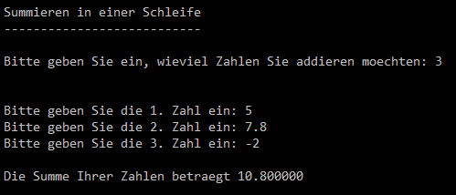
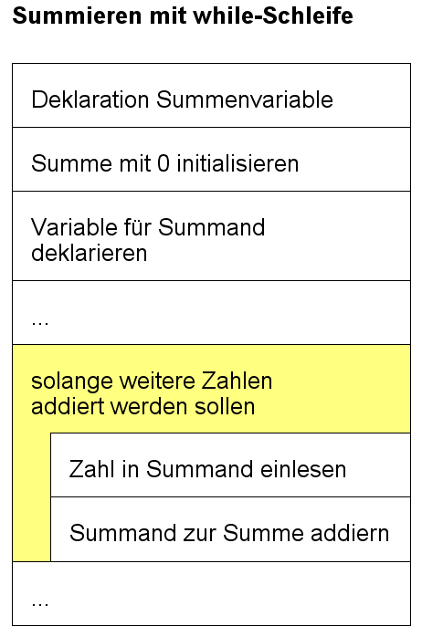

# Summieren mit einer Schleife

Summieren ist ein klassische Aufgabenstellung für Schleifen, wenn man nicht weiss wieviele Summanden aufaddiert werden sollen.
Gehen wir von folgender Problemstellung aus:

## Problemstellung
Ein Benutzer möchte eine gewisse Anzahl Summanden zusammenzählen. Die genaue Anzahl der Summanden wird vom Benutzer selber bestimmt. 
Der Dialog könnte folgendermassen aussehen:

  
*Abb. 1: Bsp: Summieren von 3 Summanden*

Man kann nun in diesem Beispiel nicht einfach 3 Variablen für die Summanden deklarieren. 
Die Anzahl 3 ist ja zur Kompilierzeit noch gar nicht bekannt. Eine naive Lösung wäre:
Man könnte zur Sicherheit Variablen für 100 Summanden deklarieren. Dies ist dann eine enorme Speicherverschwendung, wenn der Benutzer nur 3 Summanden aufaddieren möchte.
Ausserdem wäre es sehr unpraktisch, da ja trotzdem 100 Werte (ab dem vierten alle 0) eingegeben werden müssten, obwohl nur drei wirklich relevant sind. Zu guter Letzt:
Diese Lösung funktioniert nicht mehr, sobald mehr als 100 Werte addiert werden müssten.

## Lösung
Die Lösung besteht nun darin, dass nur eine Variable für alle Summanden deklariert wird und die Werte in einer Schleife eingelsen und zu einer Summenvariablen aufaddiert werden.


- [x] Es wird eine zusätzliche Variable für die Summe benötigt
- [x] Es wird eine Variable für alle Summanden benötigt
- [x] Die Summenvariable muss zwingend mit 0 initialisiert werden
- [x] In der Schleife werden die Summanden eingelesen
- [x] In der Schleife werden die Summanden zur Summe hinzuaddiert.
  
Das Struktogramm lässt sich folgendermassen darstellen:  
  
*Abb. 2: Struktogramm: Summieren mit Schleife*

## Code
Der fertige Code für die Lösung könnte folgendermassen aussehen. Die wesentlichen Punkte sind gelb markiert. 
Beachten Sie, dass natürlich immer noch eine Schleifenvariable benötigt wird. Diese wird zusätzlich für das Mitzählen der Nummer des Summanden verwendet.
```c hl_lines="5 6 15 20 22"
int main()
{
    //Deklarationen
    int nZahlen;                    //Anzahl Zahlen
    float summe;                	//Variable für die Summe deklarieren
    float summand;                  //Variable für die Summanden
    int n;                          //Schleifenvariablen

    //Eingabe
    printf("Bitte geben Sie ein, wieviel Zahlen Sie addieren moechten: ");
    scanf("%d", &nZahlen);
    printf("\n\n");

    //Eingabe, Verarbeitung
	summe = 0;						//Variable für die Summe initialisieren
    n = 0;                          //Schleifenvariablen initialisieren
    while (n < nZahlen)
    {
        printf("Bitte geben Sie die %d. Zahl ein: ", n+1);
        scanf("%f", &summand);      //Summand einlesen
		
        summe = summe + summand;    //Summand zur Summe hinzuaddieren

		n++;                        //Reinitialisierung der Schleifenvariablen
    }


    //Ausgabe
    printf("\nDie Summe Ihrer Zahlen betraegt %f\n\n", summe);

    return 0;
}
```
!!! bug "Summationsvariable initialisieren"
    In C haben Variablen nach der Deklaration keinen definierten Wert. Dieser kann manchmal 0 sein, es kann aber auch ein zufälliger Wert sein.
	Wird nun die Initialisierung der Summevariable vergessen, startet das Aufsummieren bei einem zufälligen Wert, womit das Endresultat natürlich falsch sein wird.
	Es ist deshalb in C zwingend nötig eine Summationvariable mit 0 zu initialisieren. In anderen Programmiersprachen ist diese nicht unbedingt
	nötig, gehört aber ebenfalls zur *guten Praxis*.
