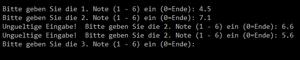
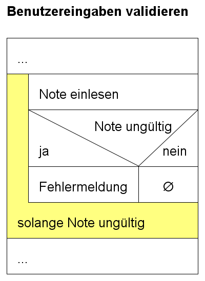

# Benutzereingaben validieren
Eine wichtige Aufgaben von Programmen aller Art ist die Validierung von Benutzereingaben. Eine Eingabe soll auf ihre Gültigkeit hin überprüft werden.
Beispielsweise soll bei einem Feld für eine Email Addresse sichergestellt sein, dass der eingegebene Text zumindest formal den Anforderungen einer Email Addresse
entspricht, also genau ein @, eine Domain, eine Topleveldomain. Um die Sache nicht zu kompliziert zu machen, gehen wir von folgender einfacher Problemstellung aus:

## Problemstellung
Für ein Programm für die statistische Auswertung von Zeugnisnoten, soll sichergestellt werden, dass keine ungültigen Noten, d.h. Noten grösser 6
erfasst werden können. Natürlich soll eine Fehleingabe mit einer Fehlermeldung quittiert werden (und nicht etwa dem Programmende). Die Note soll anschliessend
erneut eingegeben werden können. Als Programmierer muss man auch davon ausgehen, dass versucht wird, erneut eine ungültige Note einzugeben. 
Auch damit muss das Programm korrekt umgehen können. Der Dialog könnte folgendermassen aussehen:

  
*Abb. 1: Bsp: Validierung ungültiger Noten > 6* 

Die 1. eingegeben Note ist in Ordnung. Wie Sie sehen, wird bei der 2. Note versucht eine ungültige Note 7.1 einzugeben. Auch die erneute Eingabe von 6.6 ist immer noch ungültig, 
erst die dritte Eingabe 5.6 ist gültig und erst dann wird mit der Abfrage der 3. Note weitergefahren.

## Lösung
Natürlich gibt es hier verschiedene Lösungsansätze, ein elegante Lösung besteht in der Verwendung einer ```do..while``` Schleife, die solange wiederholt
wird bis die Eingabe gültig ist. Grundsätzlich könnte man auch eine ```while```-Schleife verwenden, hier eignet sich jedoch eine ```do..while``` Schleife
besser, da die Note ja auf jeden Fall mindestes einmal abgefragt werden muss, dh. die Schleife muss sicher einmal ausgeführt werden.

Das Struktogramm lässt sich folgendermassen darstellen:  
  
*Abb. 2: Struktogramm: Benutzereingabe validieren*

## Code
Der fertige Code für die Lösung könnte folgendermassen aussehen. 
```c 
...
do
{
	printf("Bitte geben Sie die %d. Note (1 - 6) ein (0=Ende): ", anzahl);
	scanf("%f", &note);
	if (note > 6)
		printf("Ungueltige Eingabe! ");
} while (note > 6);
...
```
Der Code könnte noch erweitert werden, um auch ungültige Noten < 1 korrekt zu behandeln.
