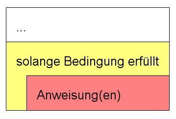

# for Schleife

## Syntax
Die dritte Art Schleife neben ```while``` und ```do..while```-Schleife ist die sogenannte ```for```-Schleife. 
Wie bei ```while``` und ```do``` handelt es sich bei ```for``` um ein Schlüsselwort von C (und von vielen anderen Programmiersprachen).

Die Aufgabe der for-Schleife ist es wei bei den anderen Schleifen, Codebestandteile zu wiederholen. 

Prägnant gesagt:

> Die ```for```-Schleife ist nichts anderes als eine kompakte Schreibweise für eine ```while```-Schleife

Die folgende Darstellung veranschaulicht den Sachverhalt. Beide Schleifen machen exakt dasselbe, nämlich die Zahlen 0 bis 9 auf der Konsole ausgeben. 
  
*Abb. 1: while-Schleife und for-Schleife*

Was passiert?

- [x] Das Schlüsselwort ```while``` wird durch das Schlüsselwort ```for``` ersetzt
- [x] Der Abschnitt innerhalb der runden Klammern hat neu drei Bestandteile
- [x] Der 1. Bestandteil nimmt die Initialisierung der Schleifenvariablen auf
- [x] Der 2. Bestandteil ist die Bedingung wie bei der ```while```-Schleife
- [x] Der 3. Bestandteil nimmt die Reinitialisierung der Schleifenvariablen auf

Wie Sie sehen ist die ganze Steuerung der Schleife mit der Schleifenvariable in den Schleifenkopf gerutscht, 
die Schleife selber enthält nun nur noch den Code der wiederholt werden soll.

!!! bug "Semikolon bei der for-Schleife"
    Die drei Abschnitte im Kopf der for-Schleife müssen durch ein Semikolon von einander getrennt werden. Ein häufiger Fehler ist es anstatt
	dem Semikolon ein einfaches Komma zu verwenden. Die führt zu einem Kompilierfehler.
	```c
	for (i = 0, i < 10, i++)  //FALSCH Komma statt Semikolon
	{
		Anweisung(en);
	} 
	``` 
## Struktogramm 
Da es sich bei der for-Schleife um nichts anderes als eine kopfgetestete while-Schleife handelt, ist auch das Struktogrammsymbol dasselbe wie bei der while Schleife  
  
*Abb. 2: Struktogramm einer for-Schleife*

## Typische Verwendung
Die typische Verwendung ist eine Schleife, welche eine vorgegebene Anzahl Mal durchlaufen wird. Möchte man beispielsweise, dass eine Schleife genau 10 Mal
durchläuft, kann man einfach den Startwert 0 für die Schleifenvariable angeben, 10 stellt die Anzahl der Durchläufe dar (0 bis 9) und die Schleifenvariable
zählt sich in Einerschritten aufwärts. Alternativ kann man auch von 10 bis 1 herunterzählen.
	
  
*Abb. 3: Typische Verwendung für eine for-Schleife*

Das Struktogramm lässt sich dann folgendermassen erstellen:  
  
*Abb. 4: Struktogramm einer typischen Verwendung*

