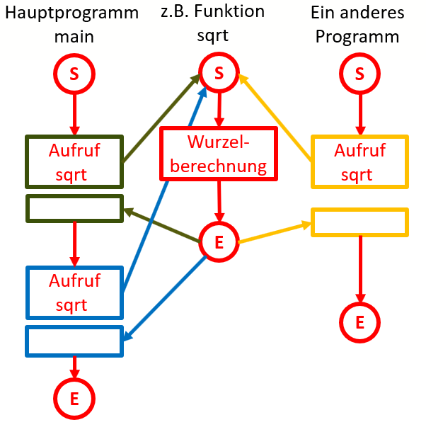

# Einführung

## Grundgedanke
Wenn der gesammt Code eines Programmes sich in ```main``` befindet, wird das Programms zunehmend unübersichtlich und schlecht wartbar. Gewisse Codebestandteile kommen immer wieder vor, wiederholen sich.
Man geht deshalb dazu über sich wiederholende Bestandteile in Funktionen oder Unterprogramme auszulagern. Damit werden folgende Punkte erreicht:

- [x] Derselbe Code kann mehrfach verwendet werden ohne sich zu wiederholen
- [x] Bessere Strukturierung des Codes
- [x] Bessere Wartbarkeit des Codes
- [x] Erstellen von Bibliotheken

Dieser Sachverhalt soll am Beispiel der Wurzelfunktion ```sqrt``` veranschaulicht werden:

In einem Hauptprogramm wird die Funktion ```sqrt``` zweimal (grün und blau) aufgerufen. Der Programmablauf verzweigt zum entsprechenden Unterprogramm (rot), danach kehrt es zum Hauptprogramm
zurük und fährt an der Stelle nach dem Aufruf weiter. Der eigentliche Code der Wurzelberechnung liegt in der Funktion und muss nicht zweimal im Hauptprogramm codiert werden.
Da die Funktion in eine Bibliothek ausgelagert wurde, kann dieselbe Funktion sogar auch von einem anderen Programm (gelb) verwendet werden.

  
*Abb. 1: Grundgedanke von Funktionen*

Die Wurzelfunktion ```sqrt``` liegt fix und fertig bereits in der Mathematikbibliothek vor. Man kann sie einfach verwenden. In diesem Kapitel geht es jedoch darum eigene Funktionen
selber zu erstellen und zu verwenden. Das Auslagern in Bibliotheken steht dabei nicht im Vordergrund. Die Funktionen befinden sich in derselben Datei in der auch das main liegt.

## Aufbau eines Programmes 
Der Aufbau eines Programmes sieht damit vorgendermassen aus:
```c
//Definition Funktion 1
funktion1()
{

}

//Definition Funktion 2
funktion2()
{

}

//weitere Funktionen
...

//Hauptprogramm
int main()
{
	//Verwenden der definierten Funktionen
} 
``` 

Wie sie sehen befinden sich die Definition der Funktionen **vor** dem eingentlichen Hauptprogramm und können dann dort verwendet werden. Die Namen der Funktionen können
beliebig gewählt werden, müssen sich jedoch an dieselben [Regeln wie die Variablennamen](../3-60) halten.

## Funktionsdefinition

Eine Funktionsdefinition hat folgende Syntax:
```c
<Datentyp> <Funktionsname> ( [Parameter] ) 
{
  Anweisung(en);
}
```

Ein Beispiel für eine Funktiondefinition:
```c
int meineFunktion ( int x, int y ) 
{
  Anweisung(en);
}
```

Das Beispiel passt ins Schema der allgemeinen Syntax:

- [x] Funktionsname: ```meineFunktion```
- [x] Datentyp des Rückgabewertes : ```int```. Der Datentyp kann auch ```void``` sein, wenn es keine Rückgabe gibt.
- [x] Parameter: ```int x``` und ```int y```. Die Anzahl der Parameter kann 0, einer oder mehrere sein.

Auf Grund der verschiedenen Möglichkeiten bei Datentyp und Parameter gibt es grundsätzlich 4 Arten von Funktionen:

!!! note "Arten von Funktionen"
	1. Funktionen ohne Parameter und ohne Rückgabe
	2. Funktionen mit Parameter und ohne Rückgabe
	3. Funktionen ohne Parameter und mit Rückgabe
	4. Funktionen mit Parameter und mit Rückgabe

Diese vier Arten werden in den folgenden Kapiteln besprochen