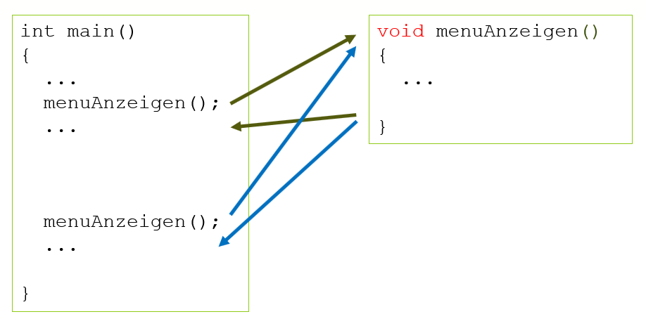

# Funktionen ohne Parameter, ohne Rückgabe

Diese Art der Funktion ist die einfachste der 4 Funktionsarten, aber auch die am wenigsten vielseitige.

Der Aufbau der Funktionsdefinition sieht folgendermassen aus:

```c
void <Funktionsname>() 
{
  Anweisung(en);
}
```

Woran erkennt man diesen Typ?

- [x] Datentyp ist ```void```. Die Funktion gibt 'nichts' (=void) ans Hauptprogramm zurück
- [x] In den runden Klammern sind keine Parameter angegeben.

Folgendes Beipiel zeigt einen Anwendungsfall

```c
void menuAnzeigen() 
{
  printf("PC1 hochfahren ......... 1");
  printf("PC2 hochfahren ......... 2");
  printf("Drucker einschalten .... 3");
  printf("Ende ................... 4");
}

int main()
{
	menuAnzeigen();
	
	//Weitere Anweisungen

}
```

Der Programmablauf sieht z.B. so aus:
  
*Abb. 1: Funktion ohne Parameter, ohne Rückgabe*

Wie man sieht kann die Funktion ```menuAnzeigen``` an mehreren Stellen im Hauptprogramm aufgerufen werden. Dort wird das Menu angezeigt. Anschliessend kehrt der Programmablauf an
die jeweilige Stelle nach dem Funktionsaufruf zurück.

!!! bug "Funktionsklammern"
	Ein häufiger Fehler ist es, beim Funktionsaufruf die runden Funktionsklammern zu vergessen. Diese werden auch dann benötigt, wenn es keine Parameter gibt.
	```c
	int main()
	{
		menuAnzeigen;	//FEHLER, die Funktionsklammern fehlen
		
		//Weitere Anweisungen

	}
	```