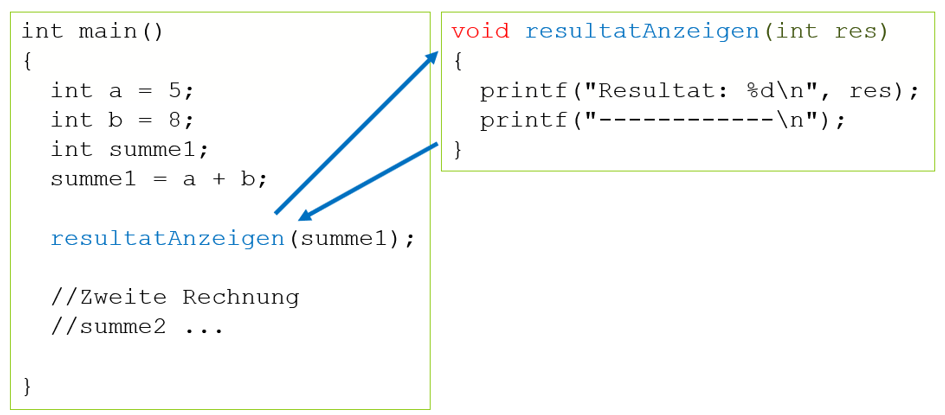

# Funktionen mit Parameter, ohne Rückgabe

Diese Art der Funktion kann beim Aufruf vom Hauptprogramm Werte (Parameter) erhalten. Die Funktion reagiert damit unterschiedlich je nach dem mit welchen Parametern sie aufgerufen wurde.

Der Aufbau der Funktionsdefinition sieht folgendermassen aus:

```c
void <Funktionsname>([Parameter]) 
{
  Anweisung(en);
}
```
Woran erkennt man diesen Typ?

- [x] Datentyp ist ```void```. Die Funktion gibt 'nichts' (=void) ans Hauptprogramm zurück
- [x] In den runden Klammern sind ein oder mehrere Parameter mit Datentyp angegeben.

Folgendes Beipiel zeigt einen Anwendungsfall

```c
void resultatAnzeigen(int res)
{
	printf("Resultat: %d\n", res);
	printf("------------\n");
}


int main()
{
	int a = 5;
	int b = 8;
	int summe1;
	summe1 = a + b;

	resultatAnzeigen(summe1);

	//Zweite Rechnung für eine summe2 ...
	int summe2 = 3 + 4;
	resultatAnzeigen(summe2);
}

```

Der Parameter summe1 bzw. summe2 wird beim Funktionsaufruf in die Funktion hinein gereicht und erhält dort den Namen res. Die Variable res ist also eine Kopie von summe1 bzw. summe2.
Dementsprechend wird beim ersten Aufruf angezeigt:  
```
Resultat: 13
------------
```  
beim zweiten Aufruf:  
```
Resultat: 7
------------
```  

Der Programmablauf sieht z.B. so aus:
  
*Abb. 1: Funktion mit Parameter, ohne Rückgabe*

Wie sie sehen reagiert die Funktion unterschiedlich in Abhängigkeit der übergebenen Parameter, einmal wird 13 angezeigt, das andere Mal 7.

!!! bug "Anzahl Parameter"
	In C muss die Anzahl der Parameter bei der Funktionsdefinition und beim Funktionsaufruf übereinstimmen.
	```c
	void resultatAnzeigen(int res)
	{
		printf("Resultat: %d\n", res);
		printf("------------\n");
	}

	int main()
	{
		resultatAnzeigen(summe1, summe2);  // FEHLER: ein Parameter zuviel
		resultatAnzeigen();                // FEHLER: ein Parameter zuwenig

	}

	```
	
!!! bug "Datentypen"
	Die Datentypen der Parameter bei der Funktionsdefinition und beim Funktionsaufruf müssen übereinstimmen. Es findet falls möglich eine Datentypkonvertierung statt.
	```c
	void resultatAnzeigen(int res)
	{
		printf("Resultat: %d\n", res);  //zeigt 3 an
		printf("------------\n");
	}

	int main()
	{
		float pi = 3.1416;
		resultatAnzeigen(pi);  // FEHLER: pi wird in der Funktion zu einem int, d.h. angezeigt wird nur 3
	}

	```