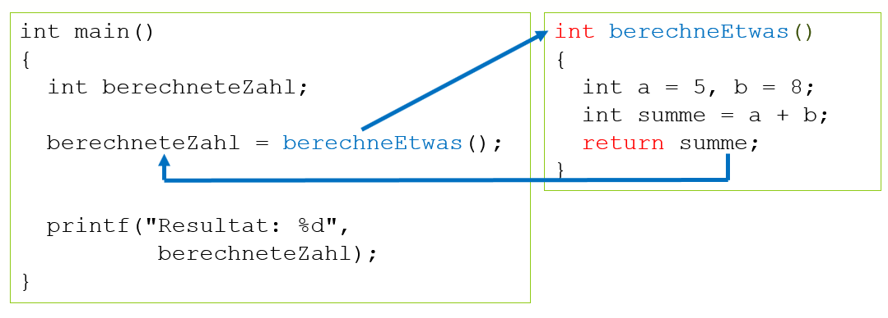

# Funktionen ohne Parameter, mit Rückgabe

Diese Art von Funktion gibt ein Resultat (z.B. das Resultat einer Berechnung) an das Hauptprogramm zurück.

```c
<Datentyp> <Funktionsname>() 
{
  <Datentyp> resultat;
  
  ...
  
  return resultat;
}
```

Woran erkennt man diesen Typ?

- [x] Datentyp ist **nicht** ```void```, sondern ein bestimmter Datentyp wie z.B. ```int, float,``` ...
- [x] In der Funktionsdefinition gibt es am Ende eine ```return``` Anweisung, welche das Resultat an das Hauptprogramm zurückgibt.

Folgendes Beipiel zeigt einen Anwendungsfall:
```c
int berechneEtwas()
{
	int a = 5, b = 8;
	int summe = a + b;
	return summe;
}

int main()
{
	int berechneteZahl;

	berechneteZahl = berechneEtwas();


	printf("Resultat: %d", berechneteZahl);
}
```

Der Programmablauf sieht z.B. so aus:
  
*Abb. 1: Funktion ohne Parameter, mit Rückgabe*

Die Summe wird in der Funktion als 13 berechnet. Die Zahl 13 wird mit ```return summe``` ans Hauptprogramm zurückgereicht und
 dort mit einer Wertzuweisung in die Variable ```berechneteZahl``` hineinkopiert.
 
!!! bug "Datenrückgabe und Wertzweisung"
	Die Datenrückgabe in der Funktionsdefinition mit return geht immer mit einer Wertzuweisung im Hauptprogramm einher. Wird die Wertzuweisung vergessen,
	hat die Variable berechneteZahl keinen Wert:
	```c
	int berechneEtwas()
	{
		int a = 5, b = 8;
		int summe = a + b;
		return summe;
	}

	int main()
	{
		int berechneteZahl;

		berechneEtwas();  //FEHLER, keine Wertzuweisung

		printf("Resultat: %d", berechneteZahl); //zeigt Unsinn an, da berechneteZahl keinen Wert erhalten hat
	}
	```
	
!!! bug "return"
	Wird return vergessen, kommt der berechnete Wert nie im Hauptprogramm an:
	```c
	int berechneEtwas()
	{
		int a = 5, b = 8;
		int summe = a + b;
								//FEHLER, return vergessen
	}

	int main()
	{
		int berechneteZahl;

		berechneteZahl = berechneEtwas();  

		printf("Resultat: %d", berechneteZahl); //zeigt Unsinn an, da die summe gar nicht 'abgeschickt' wurde
	}
	```	
	
Wie Sie sehen besteht eine Funktion mit Rückgabe aus zwei Dingen:

- [x] Das Resultat muss mit return *abgeschickt* werden
- [x] Das Resultat muss mit einer Wertzuweisung *entgegengenommen* werden

!!! bug "Datenrückgabe und Datentyp"
	Der Datentyp der zurückgegebenen Variablen muss mit dem Datentyp der Funktion übereinstimmen. Es findet, falls möglich eine Datenkonvertierung statt:
	```c
	int berechnePI()  //FEHLER, pi wird als int zurückgegeben
	{
		double pi;
		...
		return pi;
	}

	int main()
	{
		double berechnetesPI;

		berechnetesPI = berechnePI();  

		printf("Resultat: %lf", pi); //zeigt 3.00000 an
	}
	```