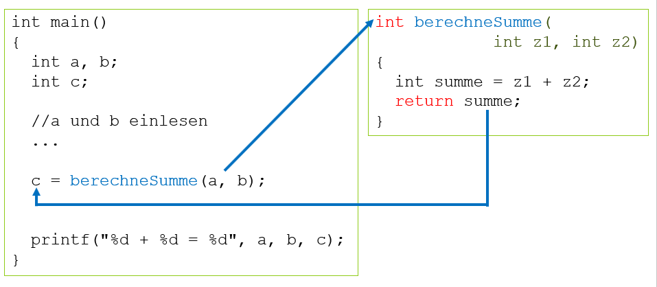

# Funktionen mit Parameter, mit Rückgabe

Diese Funktionsart hat sowohl Parameter als auch einen Rückgabewert;

```c
<Datentyp> <Funktionsname>([Parameter]) 
{
  <Datentyp> resultat;
  
  ...
  
  return resultat;
}
```

Woran erkennt man diesen Typ?

- [x] Datentyp ist **nicht** ```void```, sondern ein bestimmter Datentyp wie z.B. ```int, float,``` ...
- [x] In den runden Funktonsklammern gibt es einem oder mehrere Parameter

Folgendes Beipiel zeigt einen Anwendungsfall:
```c
int berechneSumme( int z1, int z2)
{
	int summe = z1 + z2;
	return summe;
}

int main()
{
	int a, b;
	int c;

	//a und b einlesen
	...

	c = berechneSumme(a, b);

	printf("%d + %d = %d", a, b, c);
}
```
Der Programmablauf sieht z.B. so aus:
  
*Abb. 1: Funktion ohne Parameter, mit Rückgabe*

Die beiden eingelesenen Werte a und b werden in die Funktion hineingereicht und dort in die Varaiblen z1 und z2 kopiert. Von diesen wird die Summe berechnet,
 welche ins Hauptprogramm zurückgeht und dort mit einer Wertzuweisung in die Variable c kopiert. Anschliessen wird die Rechnung mit printf angezeigt.
