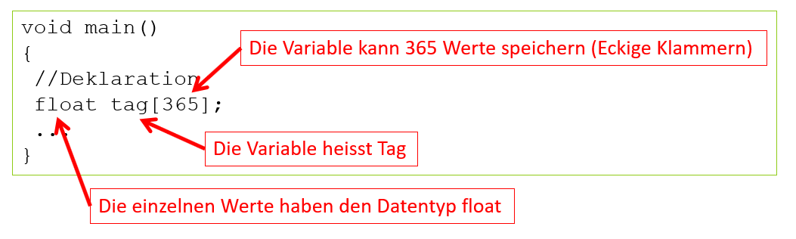
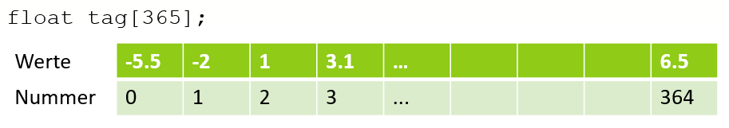
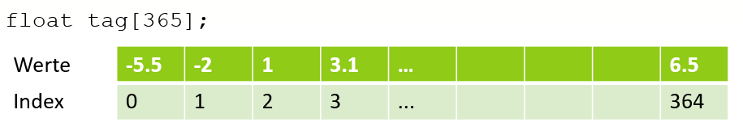

# Lösung

## Deklaration eines Arrays
Anstelle von 365 Variablen wird nur eine Variable deklariert, diese kann aber 365 verschiedene Werte speichern. Eine solche Variable wird als Array bezeichnet
  
*Abb. 1: Deklaration eines Arrays*

Einen Array kann man sich bildlich so vorstellen:
  
*Abb. 2: Bildliche Darstellung eines Arrays*

Die Werte des Arrays werden in einer Reihe der Einzelwerte dargestellt. Jeder Einzelwert hat eine Nummer. 
Die Nummerierung beginnt (wie in der Informatik üblich) bei 0 und geht bis 364.

Wichtig:  

- [x] Der Fachbegriff für die Nummer im Array lautet **Index**
- [x] Der Index geht von **0** bis **364**
- [x] Die Variable ```tag``` benötigt 365 x 4 Bytes = 1460 Bytes an Speicherplatz

## Zugriff auf die Werte
Der Zugriff auf die einzelnen Werte eines Array erfolgt über den Index:
  
*Abb. 3: Bildliche Darstellung eines Arrays*

```c 
int main()
{
	//Deklarationen
	float tag[365]; 
	...

	//Wertzuweisung (schreiben)
	tag[0] = -5.5; //Das Element mit dem Index 0 erhält den Wert -5.5
	tag[1] = -2;
	tag[2] = 1;
	...
	tag[364] = 6.5;
	
	//Wertausgabe (lesen):
	printf("%f", tag[0]); //Zeigt -5.5 an
	printf("%f", tag[1]);
	...
}
```

An dieser Stelle zeigt sich der Vorteil eines Array gegenüber des [naiven Lösungsansaztes](../8-10/#naiver-ansatz) noch nicht. 
Immer noch gibt es viel Schreibarbeit und eine grosse Fehleranfälligkeit durch copy paste. Der Vorteil kommt aber sofort zur Geltung,
wenn man Arrays mit for-Schleifen kombiniert.

