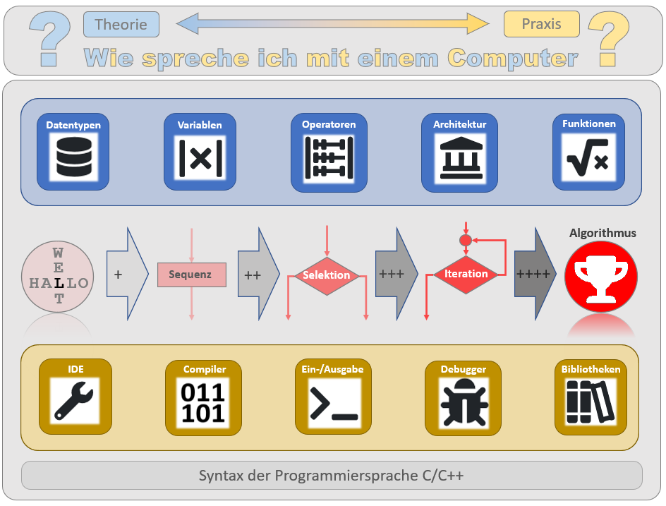

# Handlungsziele
**Modul 319**  Applikationen entwerfen und implementieren  

- [x] Erfasst Problemstellungen, entwickelt strukturiert Lösungsansätze und übersetzt sie für die Stakeholder. 
- [x] Erstellt eine geeignete visuelle Darstellung für die Programmierung von Anforderungen. 
- [x] Leitet aufgrund der Vorgaben die erforderlichen Daten (Eingabe, Verarbeitung, Ausgabe und ihre Datentypen) ab.
- [x] Implementiert die Applikation mit Hilfe von Kontrollstrukturen und selbst erstellten Funktionen.
- [x] Hält vorgegebene Konventionen ein, kommentiert den Code und achtet dabei auf die Wartbarkeit.
- [x] Interpretiert Mängel (Fehler) in der Software und korrigiert diese.
  
  
# Handlungsnotwendige Kenntnisse
  
*Abb. 1: Handlungsnotwendige Kenntnisse*